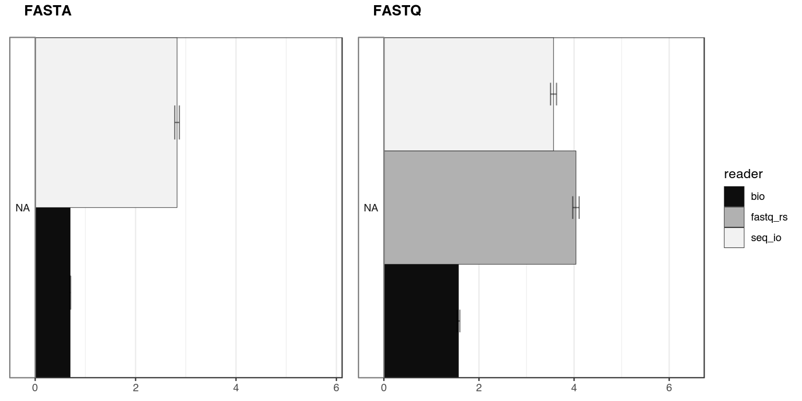
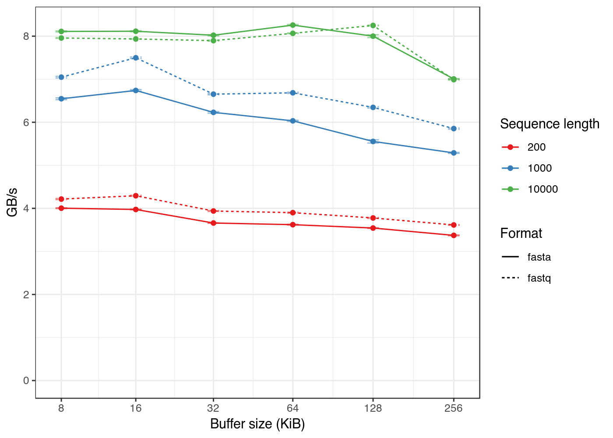

# Benchmarks

All comparisons were run on a set of auto-generated FASTA or FASTQ sequences
with lengths normally distributed around 300 bp and loaded into memory.
For FASTA, sequences were either on a single line ("FASTA" in barplots) or
wrapped at the length of 80 (4 sequence lines).

The bars represent the throughput in GB/s (+/- standard error of the mean),
as measured using *criterion*. 
Run on a Intel i7-8550U with turbo boost disabled.

To run the benchmarks and generate the summary charts, run 
`scripts/run_bench.sh`. The charts need *R* and *ggplot2* installed.

## Comparison of parsers
 
Different aspects of the API were compared, always using the same input for a
given format.
The darker bars show results for parsers from other crates
([fastq-rs](https://github.com/aseyboldt/fastq-rs)
and [Rust-Bio](https://rust-bio.github.io/)).

A few points on the results:

* The standard way of iterating is fastest, any operation involving
  allocations (such as `RefRecord::to_owned_record()`) slows down the process.
* FASTX readers are almost as fast as readers specialized on one format.
  The `seq_io::fastx::dynamic` readers were slower than `seq_io::fastx`
  in this benchmark.
* Access to the contiguous sequence is fast if the sequence consists of a single
  line. If wrapped to multiple lines, `RefRecord::full_seq_given` is the best
  solution. Similarly and not surprisingly, `RefRecord::clone_into_owned()`
  is the fastest solution for obtaining an `OwnedRecord` from `RefRecord`.
* Accessing the sequence ID has some performance impact, since the space
  separating ID and description needs to be searched. However, checks for
  validity of `UTF-8` had the strongest impact.
* A specialized reader only accepting single FASTA lines (`seq_io::fasta::single_line`)
  is considerably faster.

## Buffer capacity and sequence length

Readers were also tested with different internal buffer capacities using
randomly generated single-line FASTA and FASTQ input with different sequence
lengths.

The current default buffer capacity is 64 KiB.

