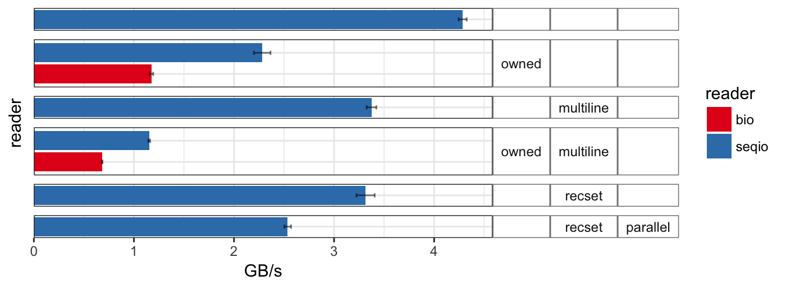
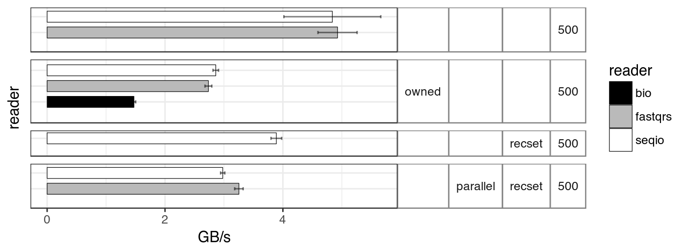

# FASTA and FASTQ parsing in Rust

This library provides an(other) attempt at high performance FASTA and FASTQ parsing.
There are many similarities to the excellent [fastq-rs](https://github.com/aseyboldt/fastq-rs)
crate. However, the API that provides streaming iterators where possible.
The parsers will not panic if a record is too large to fit into the 
buffer (like fastq_rs). Instead, the buffer will grow until the record 
can be accomodated. How the buffer grows can be configured by choosing or customizing 
implementations of the `BufGrowStrategy` trait.
The [buf_redux](https://github.com/abonander/buf_redux) library provides the
underlying buffered reader. Byte copies are only done when the end of the 
buffer is reached and an incomplete record is moved to the start.

**Note:** Make sure to compile with LTO enabled because calls to *buf\_redux* functions 
are not inlined otherwise.

[View API documentation](https://docs.rs/seq_io)

## Multi-threaded processing
The functions from the `parallel` module provide possibilities to send FASTQ/FASTA
records to a thread pool where expensive calculations are done.
Sequences are processesd in batches (`RecordSet`) because sending across 
channels has a performance impact. FASTA/FASTQ records can be accessed in
both the 'worker' function and (after processing) a function running in the 
main thread.

## Performance comparisons

All comparisons were run on a set of 100,000 auto-generated, synthetic sequences
of uniform length (500 bp) loaded into memory. The parsers from this crate
(*seqio*) are compared with [fastq-rs](https://github.com/aseyboldt/fastq-rs) (*fastqrs*)
and [Rust-Bio](https://rust-bio.github.io/) (*bio*).
The bars represent the throughput in GB/s, the error bars show the
+/- deviation as inferred from the deviations provided by
`cargo bench`, that is: (max\_time - min\_time) / 2 used per iteration.
Run on a Mac Pro (Mid 2010, 2.8 GHz Quad-Core Intel Xeon, OS X 10.9.5) using Rust 1.19 nightly

**Explanation of labels**:

* *Top bars*: Iteration over all records without further action.
* *owned*: An owned copy of each record is created for comparison with *Rust-Bio*,
  which does not provide zero copy parsing. 
* *multiline*: The FASTA sequence is split into 5 x 100 bp lines.
* *recset*: Records are parsed into record sets using `read_record_set()` (involves some copying).
* *parallel*: Record sets are are sent to worker threads for parallel processing
  where they are being iterated over and then sent back to the main thread
  where there is another iteration over the records (the latter only in seq_io)

**FASTA**

  
**FASTQ**

### Remarks

* The FASTQ reader from this crate performs similar to the fastq_rs reader.
* The rust-bio readers are much slower due to copying and allocations.
  Interestingly, it is also slower if creating owned records (`OwnedRecord`)
  from the `RefRecord` instances. This doesn't just seem to be due to UTF-8 validity
  checks done by Rust-Bio.
* The FASTA readers are slowed down considerably if the sequence is split into multiple lines.
  I created an experimental parser (not included here) that searches only for
  record starts (`\n>`) and is not slowed down by multi-line FASTA. However,
  this parse is only in advantage if the sequence is not accessed at all (only header lines)...
