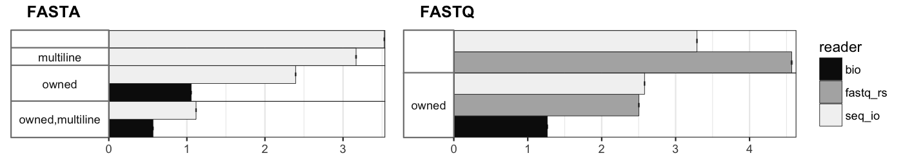

# FASTA and FASTQ parsing and writing in Rust.


[](https://travis-ci.org/markschl/seq_io)

**Note:** the master branch contains the development for version 0.4.0. The
currently stable version is [on a separate branch](https://github.com/markschl/seq_io/tree/v0.3).

This library provides readers for the the following sequence formats:

* *FASTA*
* *FASTQ* (including multi-line FASTQ)
* *"FASTX"*: Automatic recognition of the sequence format (either FASTA or FASTQ)

[**Documentation for development version (0.4.0-alpha.x)**](https://docs.rs/seq_io/0.4.0-alpha.0/seq_io/index.html)

[**Documentation for the stable version (0.3.x)**](https://docs.rs/seq_io)


## Features

* Fast readers that minimize the use of allocations and copying of memory
* Flexible methods for writing FASTA and FASTQ
* Informative errors with exact positional information
* Support for recording the position and seeking back
* Serde support (for owned data structures)
* Functions for parallel processing
* Thoroughly tested using fuzzing techniques [see here](FUZZING.md)


## Simple example

Reads FASTA sequences from STDIN and writes them to STDOUT if their length is 
\> 100. Otherwise it prints a message.

```rust
use seq_io::fasta::{Reader,Record};
use std::io;

let mut reader = Reader::new(io::stdin());
let mut stdout = io::stdout();

while let Some(result) = reader.next() {
    let record = result.expect("reading error");
    // determine sequence length
    let seqlen = record.seq_lines()
                       .fold(0, |l, seq| l + seq.len());
    if seqlen > 100 {
        record.write_wrap(&mut stdout, 80).expect("writing error");
    } else {
        eprintln!("{} is only {} long", record.id().expect("not UTF-8"), seqlen);
    }
}
```

Records are directly borrowing data from the internal buffered reader,
no further allocation or copying takes place.
As a consequence, the `while let` construct has to be used instead of a `for`
loop.

`seq_lines()` directly iterates over the sequence lines, whose position 
is remembered by the record, again without further copying.

**Note:** Make sure to add `lto = true` to the release profile in `Cargo.toml`
because calls to functions of the underlying buffered reader
([buf_redux](https://github.com/abonander/buf_redux)) are not inlined otherwise.


### Similar projects in Rust

* *[Rust-Bio](https://rust-bio.github.io)*: Binformatics library that provides
  simple and easy to use FASTA and FASTQ readers.
* *[fastq-rs](https://github.com/aseyboldt/fastq-rs)*: Very fast FASTQ parser.
  `seq_io` was inspired by `fastq_rs` in many ways.
* *[Needletail](https://github.com/onecodex/needletail)*: FASTA, FASTQ, FASTX
* *[fasten](https://github.com/lskatz/fasten)* implements its own FASTQ reader

### Performance comparisons

The following bar chart shows the results of a few benchmarks on random
sequences generated in memory (FASTA sequences either on a single line or 
wrapped to a width of 80).

The readers from this crate are also compared with 
[fastq-rs](https://github.com/aseyboldt/fastq-rs)
and [Rust-Bio](https://rust-bio.github.io) parsers. The latter is only present
in the "owned" section, since there is no possibility to iterate without
allocating records.

More benchmarks can be found on a [separate page](BENCHMARK.md).



